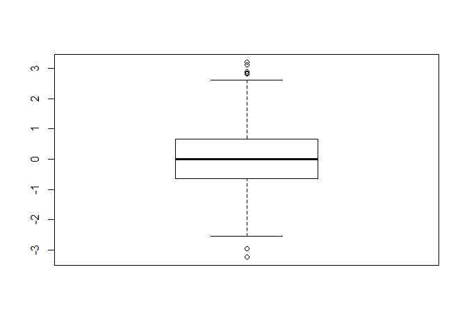
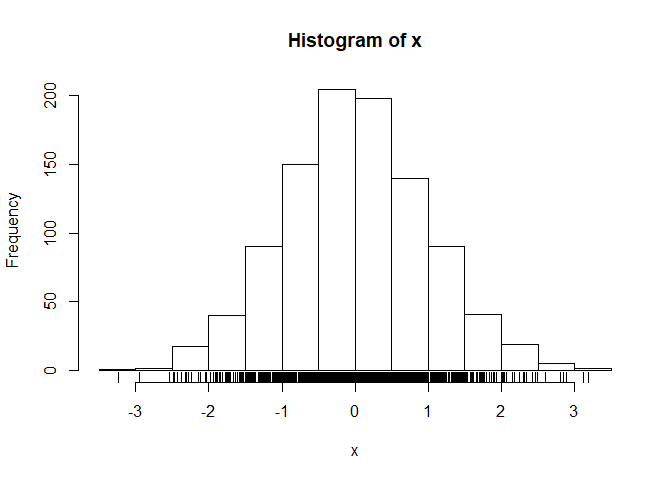
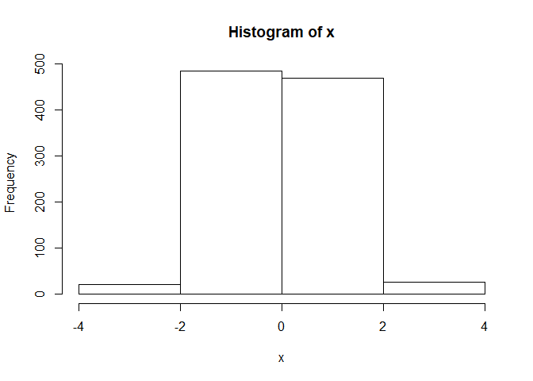
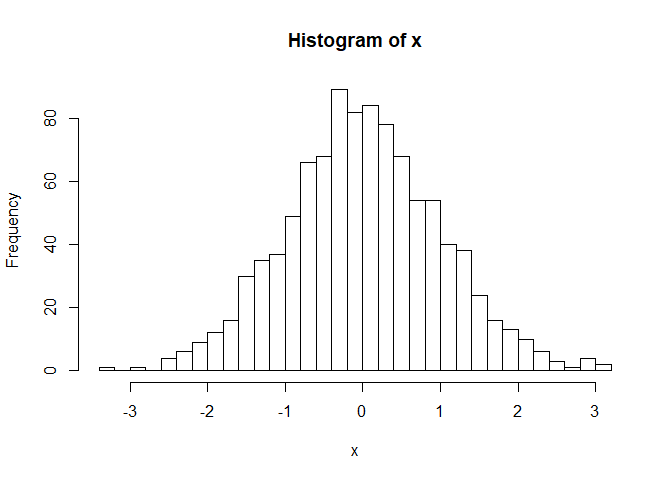
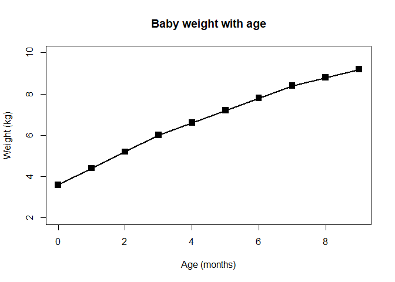
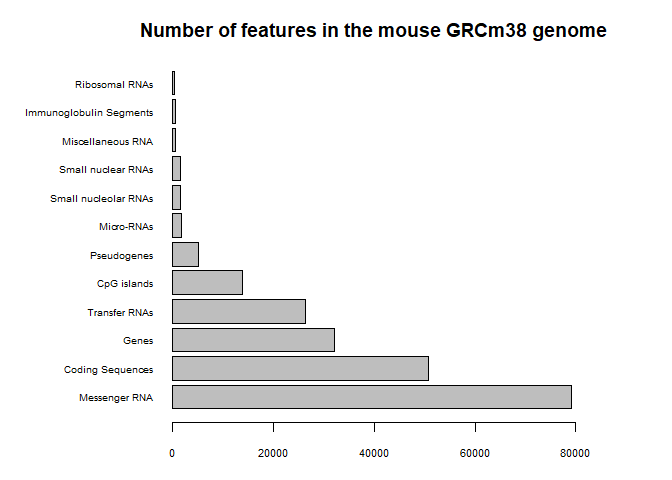
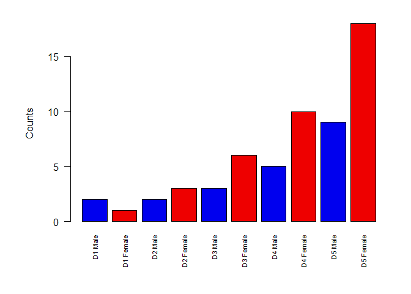
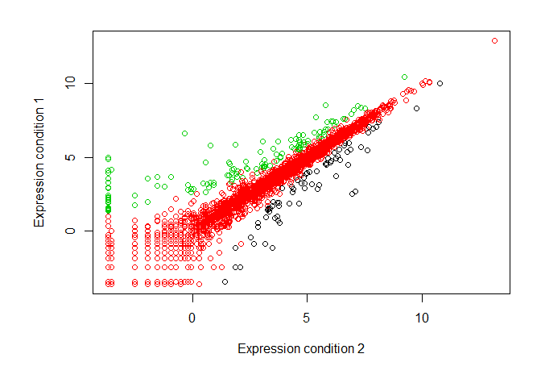

Class 5 Data Exploration and visualization in R
================
fabia
2019-11-01

``` r
# Class 5 Data visualization

x <- rnorm(1000)

# How many things are in x
length(x)
```

    ## [1] 1000

``` r
mean(x)
```

    ## [1] 0.009487819

``` r
sd(x)
```

    ## [1] 0.9888277

``` r
summary(x)
```

    ##      Min.   1st Qu.    Median      Mean   3rd Qu.      Max. 
    ## -3.235149 -0.639633 -0.007490  0.009488  0.661533  3.195437

``` r
boxplot(x)
```

<!-- -->

``` r
hist(x)
rug(x)
```

<!-- -->

``` r
hist(x, breaks = 3)
```

<!-- -->

``` r
hist(x, breaks = 30)
```

<!-- -->

``` r
# Section 2
weight <- read.table(file="bimm143_05_rstats/weight_chart.txt", 
                     header = TRUE)

plot(weight$Age, weight$Weight, 
     type="o", 
     pch=15, 
     cex=1.5, 
     lwd=2, 
     ylim=c(2,10), 
     xlab="Age (months)", 
     ylab="Weight (kg)", 
     main="Baby weight with age")
```

<!-- -->

``` r
mouse <- read.table(file="bimm143_05_rstats/feature_counts.txt", 
           header=TRUE,
           sep="\t")

par(mar=c(3,9,3,5))
barplot(mouse$Count,
        horiz=TRUE,
        names.arg=mouse$Feature,
        main="Number of features in the mouse GRCm38 genome",
        las=1,
        xlim=c(0,80000),
        cex.axis=0.7,
        cex.name=0.6)
```

<!-- -->

``` r
# Section 3. Using color
mf <- read.delim("bimm143_05_rstats/male_female_counts.txt")

par(mar=c(6,6,2,2))
barplot(mf$Count,
        names.arg = mf$Sample,
        ylab="Counts",
        cex.names=0.7,
        las=2,
        col=c("blue2","red2"))
```

<!-- -->

``` r
genes <- read.delim("bimm143_05_rstats/up_down_expression.txt")
nrow(genes)
```

    ## [1] 5196

``` r
table(genes$State)
```

    ## 
    ##       down unchanging         up 
    ##         72       4997        127

``` r
plot(genes$Condition1, genes$Condition2,
     xlab="Expression condition 2",
     ylab="Expression condition 1",
     col=genes$State)
```

<!-- -->
