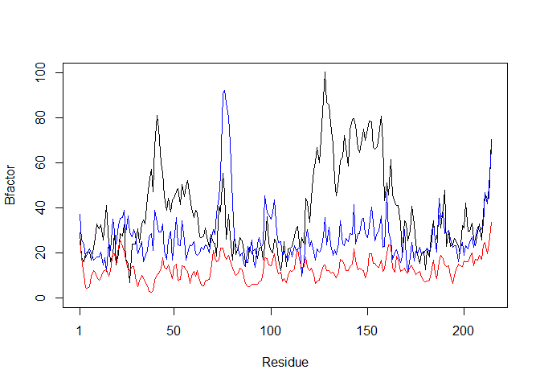
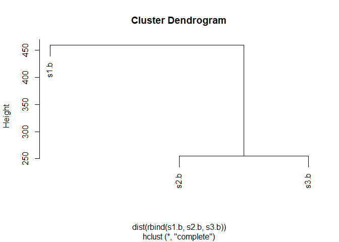

Class 6 R Functions
================
Fabian Lim
10/18/2019

# Test 1

``` r
read.table("test1.txt", sep=",", header=TRUE)
```

    ##   Col1 Col2 Col3
    ## 1    1    2    3
    ## 2    4    5    6
    ## 3    7    8    9
    ## 4    a    b    c

``` r
read.csv("test1.txt")
```

    ##   Col1 Col2 Col3
    ## 1    1    2    3
    ## 2    4    5    6
    ## 3    7    8    9
    ## 4    a    b    c

``` r
read.table("test2.txt", sep="$", header = TRUE)
```

    ##   Col1 Col2 Col3
    ## 1    1    2    3
    ## 2    4    5    6
    ## 3    7    8    9
    ## 4    a    b    c

``` r
read.table("test3.txt")
```

    ##   V1 V2 V3
    ## 1  1  6  a
    ## 2  2  7  b
    ## 3  3  8  c
    ## 4  4  9  d
    ## 5  5 10  e

Our first silly function

``` r
add <- function(x, y=1) {
 # Sum the input x and y
 x + y
}
```

``` r
add(5)
```

    ## [1] 6

``` r
add(x=c(5,6, 1, 5, 10), y=100)
```

    ## [1] 105 106 101 105 110

``` r
add(c(5, 5, 7))
```

    ## [1] 6 6 8

``` r
add(c(5, 5, NA, 7))
```

    ## [1]  6  6 NA  8

``` r
x <- range(c(5, 2, 7, 10))
x[1] #min value
```

    ## [1] 2

``` r
x[2] #max value
```

    ## [1] 10

Second function

``` r
rescale <- function(x) {
 rng <-range(x)
 (x - rng[1]) / (rng[2] - rng[1])
}
rescale(c(1,10,NA,3,9))
```

    ## [1] NA NA NA NA NA

``` r
rescale2 <- function(x) {
 rng <-range(x,na.rm=TRUE)
 (x - rng[1]) / (rng[2] - rng[1])
}
rescale2(c(1,10,NA,3,9))
```

    ## [1] 0.0000000 1.0000000        NA 0.2222222 0.8888889

``` r
rescale3 <- function(x, na.rm=TRUE, plot=FALSE) {
 if(na.rm) {
 rng <-range(x, na.rm=TRUE)
 } else {
 rng <-range(x)
 }
 print("Hello")
 answer <- (x - rng[1]) / (rng[2] - rng[1])
 print("is it me you are looking for?")
 if(plot) {
 plot(answer, typ="b", lwd=4)
 }
 print("I can see it in ...")
return(answer)}
rescale3(1:10)
```

    ## [1] "Hello"
    ## [1] "is it me you are looking for?"
    ## [1] "I can see it in ..."

    ##  [1] 0.0000000 0.1111111 0.2222222 0.3333333 0.4444444 0.5555556 0.6666667
    ##  [8] 0.7777778 0.8888889 1.0000000

## Hands on lab

``` r
library(bio3d)
s1 <- read.pdb("4AKE") # kinase with drug
```

    ##   Note: Accessing on-line PDB file

``` r
s2 <- read.pdb("1AKE") # kinase no drug
```

    ##   Note: Accessing on-line PDB file
    ##    PDB has ALT records, taking A only, rm.alt=TRUE

``` r
s3 <- read.pdb("1E4Y") # kinase with drug
```

    ##   Note: Accessing on-line PDB file

``` r
s1.chainA <- trim.pdb(s1, chain="A", elety="CA")
s2.chainA <- trim.pdb(s2, chain="A", elety="CA")
s3.chainA <- trim.pdb(s3, chain="A", elety="CA")
s1.b <- s1.chainA$atom$b
s2.b <- s2.chainA$atom$b
s3.b <- s3.chainA$atom$b
plotb3(s1.b, sse=s1.chainA, typ="l", ylab="Bfactor")
```

<!-- -->

``` r
plotb3(s2.b, sse=s2.chainA, typ="l", ylab="Bfactor")
```

<!-- -->

``` r
plotb3(s3.b, sse=s3.chainA, typ="l", ylab="Bfactor")
```

<!-- -->

``` r
x <- read.pdb("4AKE")
```

    ##   Note: Accessing on-line PDB file

    ## Warning in get.pdb(file, path = tempdir(), verbose = FALSE): C:
    ## \Users\fabia\AppData\Local\Temp\RtmpKSBBgC/4AKE.pdb exists. Skipping
    ## download

``` r
is.list(x)
```

    ## [1] TRUE

``` r
x
```

    ## 
    ##  Call:  read.pdb(file = "4AKE")
    ## 
    ##    Total Models#: 1
    ##      Total Atoms#: 3459,  XYZs#: 10377  Chains#: 2  (values: A B)
    ## 
    ##      Protein Atoms#: 3312  (residues/Calpha atoms#: 428)
    ##      Nucleic acid Atoms#: 0  (residues/phosphate atoms#: 0)
    ## 
    ##      Non-protein/nucleic Atoms#: 147  (residues: 147)
    ##      Non-protein/nucleic resid values: [ HOH (147) ]
    ## 
    ##    Protein sequence:
    ##       MRIILLGAPGAGKGTQAQFIMEKYGIPQISTGDMLRAAVKSGSELGKQAKDIMDAGKLVT
    ##       DELVIALVKERIAQEDCRNGFLLDGFPRTIPQADAMKEAGINVDYVLEFDVPDELIVDRI
    ##       VGRRVHAPSGRVYHVKFNPPKVEGKDDVTGEELTTRKDDQEETVRKRLVEYHQMTAPLIG
    ##       YYSKEAEAGNTKYAKVDGTKPVAEVRADLEKILGMRIILLGAPGA...<cut>...KILG
    ## 
    ## + attr: atom, xyz, seqres, helix, sheet,
    ##         calpha, remark, call

``` r
plotb3(s1.b, sse=s1.chainA, typ="l", ylab="Bfactor", top=FALSE, bot=FALSE)
```

<!-- -->

``` r
plotb3(s1.b, sse=s1.chainA, typ="l", ylab="Bfactor", top=FALSE, bot=FALSE)
points(s2.b,typ="l",col="blue")
points(s3.b,typ="l",col="red")
```

<!-- -->

``` r
hc <- hclust(dist(rbind(s1.b, s2.b, s3.b)))
plot(hc)
```

<!-- -->

## Homework question 6

``` r
#Function to generate graph for protein of interest
plot_protein <- function(x) {
  sx <- read.pdb(x)
sx.chainA <- trim.pdb(sx, chain="A", elety="CA")
sx.b <- sx.chainA$atom$b
plotb3(sx.b, sse=sx.chainA, typ="l", ylab="Bfactor")
}

# Example protein is 4AKE
x <- "4AKE"

# Plot graph
plot_protein(x)
```

    ##   Note: Accessing on-line PDB file

    ## Warning in get.pdb(file, path = tempdir(), verbose = FALSE): C:
    ## \Users\fabia\AppData\Local\Temp\RtmpKSBBgC/4AKE.pdb exists. Skipping
    ## download

<!-- -->
