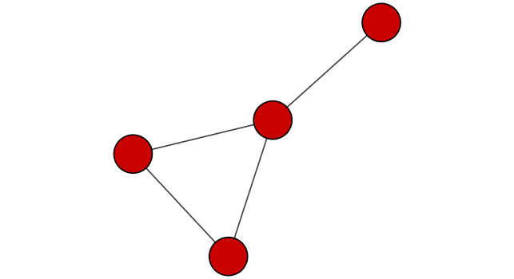
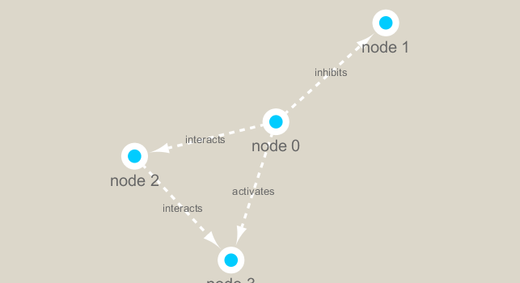

```{r setup, include=FALSE}
knitr::opts_chunk$set(echo = TRUE)
```

## Install required packages

```{r eval=FALSE}
install.packages("igraph")
BiocManager::install("RCy3")
```

```{r}
library(RCy3)

# Test the connection to Cytoscape.
cytoscapePing()
```

```{r}
# Check the version
cytoscapeVersionInfo()
```

```{r}
g <- makeSimpleIgraph()
createNetworkFromIgraph(g,"myGraph")
```

```{r}
fig <- exportImage(filename="demo", type="png", height=350)
```

```{r}

```

Switch styles

```{r}
setVisualStyle("Marquee")
```

```{r}
fig <- exportImage(filename="demo_marquee", type="png", height=350)


```

```{r}
styles <- getVisualStyleNames()
styles
```

```{r}
plot(g)
```


