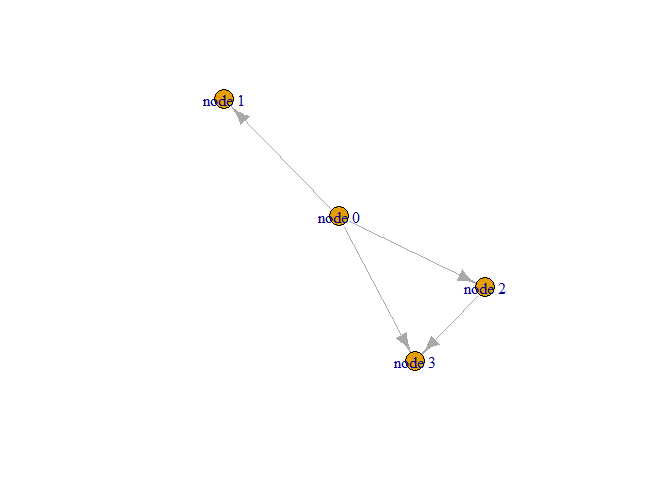

Class 16 Metagenomics co-occurence networks
================

## Install required packages

``` r
install.packages("igraph")
BiocManager::install("RCy3")
```

``` r
library(RCy3)

# Test the connection to Cytoscape.
cytoscapePing()
```

    ## [1] "You are connected to Cytoscape!"

``` r
# Check the version
cytoscapeVersionInfo()
```

    ##       apiVersion cytoscapeVersion 
    ##             "v1"          "3.7.2"

``` r
g <- makeSimpleIgraph()
createNetworkFromIgraph(g,"myGraph")
```

    ## Loading data...
    ## Applying default style...
    ## Applying preferred layout...

    ## networkSUID 
    ##          80

``` r
fig <- exportImage(filename="demo", type="png", height=350)
```

    ## Warning: This file already exists. A Cytoscape popup 
    ##                 will be generated to confirm overwrite.

``` r
knitr::include_graphics("./demo.png")
```

<!-- -->

Switch styles

``` r
setVisualStyle("Marquee")
```

    ##                 message 
    ## "Visual Style applied."

``` r
fig <- exportImage(filename="demo_marquee", type="png", height=350)
```

    ## Warning: This file already exists. A Cytoscape popup 
    ##                 will be generated to confirm overwrite.

``` r
knitr::include_graphics("./demo_marquee.png")
```

<!-- -->

``` r
styles <- getVisualStyleNames()
styles
```

    ##  [1] "Solid"                "Gradient1"            "Universe"            
    ##  [4] "default black"        "Nested Network Style" "Curved"              
    ##  [7] "Minimal"              "size_rank"            "BioPAX"              
    ## [10] "default"              "Ripple"               "Big Labels"          
    ## [13] "Directed"             "BioPAX_SIF"           "Sample2"             
    ## [16] "Sample1"              "Marquee"              "Sample3"

``` r
plot(g)
```

<!-- -->
